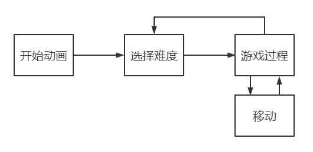
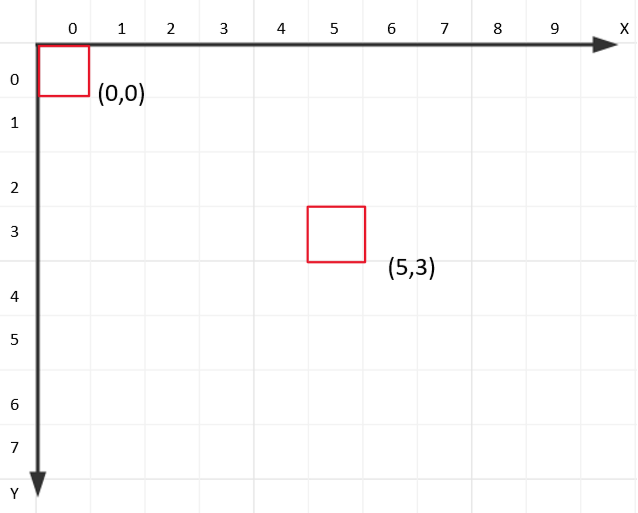

# GreedySnake

# 贪吃蛇

## 设计思路：

该游戏的玩法简单，玩家通过键盘方向键控制蛇上下左右移动，吃到食物得分并增长，碰到墙或者自己的身体则死亡，游戏结束。
整个游戏其实就是一个无穷的循环，直到退出游戏时退出循环。我们暂且将这个循环称为一级循环，这个循环包含游戏开始动画（游戏开始动画不在循环中？），游戏难度选择，游戏过程这三个子模块，其中游戏过程这个模块亦是一个循环，我们暂且将其称为二级循环。它们之间的关系大致如下图：

## 实现细节：

### 1、游戏开始动画

开始动画的实现主要依靠对点的操作来实现，这里我们先建立一个概念，就是将控制台界面看成一个原点在左上角的坐标系，一个点（x，y）表示坐标系中的一个格子，如下图所示：

开始动画是由一条蛇和一行文字从左到右移动而成，这里我们先单独讨论一下蛇，要达到移动的效果，我采取的策略是将整个过程分为三部分：
第一部分为蛇从左边开始出现到整个身体完全出现；
第二部分为蛇身整体从左移动到接触右边界的过程；
第三部分为蛇从接触右边界到完全消失的过程。

我们先来看一下第一部分，这一部分的实现首先是建立一个deque双端队列，用于存储点的对象，这些点就是组成蛇身的元素，然后再用一个for循环将容器中的点依次打印出来，每打印一个点停顿一会，这样就达到了移动的效果。全部打印完后就到了第二部分，这部分蛇的每次前进都是通过计算将要移动到的下一个点的坐标，然后将这个点打印出来，与此同时将蛇尾，亦即queue中的首端点去掉，并擦除屏幕上该点颜色。第三部分就直接依次从蛇尾擦除即可。同理，文字snake的移动也基本类似，稍微改动即可，因为无需对首尾进行操作，而是要对所以点进行移动，因此容器选用vector。具体请参看startinterface.h以及startinterface.cpp。

### 2、选择难度

其实这个模块很简单，我就简单介绍一下，先将难度选择的文字信息打印在屏幕上，然后通过控制键盘方向键选择，回车键确认，为了突出选中项，需要给选中项打上背景色，然后每一次上下移动时，先将当前的背景色去掉，然后给下一个选中项打上背景色，按下回车后通过改变蛇移动的速度实现改变难度。其中读取键盘输入是通过 _getch() 函数完成的。

### 3、游戏过程

这个模块就是整个游戏最主要的部分了，首先它先绘制出地图以及侧边栏，同时初始化蛇和食物，然后通过一个无穷循环监听键盘，以此来控制蛇移动，同时又进行各种判断，来判断是否死亡、吃到食物或暂停。需要提一下，这里使用 _kbhit() 函数来监听键盘，它用来判断在一段固定的时间内是否有键盘输入，要知道，这个函数的返回值有两个，第一个是是否有输入的返回值，第二个才是键盘输入的内容，也就是说要经过两次的读取缓冲区才能读到真正的键盘输入。