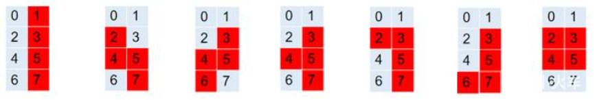
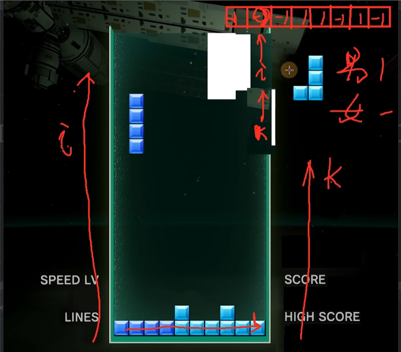

# Tetris 俄罗斯方块

## 1、设计类：

​	1.1方块类 Block

​	1.2 游戏类 Tetris

## 2、设计各个模块的接口：

​	2.1 方块类对外接口

​	2.2 游戏类对外接口

## 3、游戏开始：

### 3.1 生成一个游戏对象，并初始化；

### 3.2 游戏开始

#### 3.2.1 游戏初始化

#### 3.2.2 游戏死循环（任何游戏都是一个死循环）

​	3.2.2.1 接受用户的输入

​	3.2.2.2 渲染游戏画面（为了节省系统资源，不能一直渲染，需要添加延时程序 ）：延时程序的延时量可以设置成私有成员变量

- 如果未到时间也想进行渲染怎么做？加一个bool变量，来根据用户的动作判断是否渲染。
- 渲染游戏画面时，也要drop函数。
- 渲染游戏画面时，也要更新游戏数据（比如清行）。

## 4、方块的设计：

### 4.1 如何设计几种方块

一般的俄罗斯方块的设计实现：假如有7种俄罗斯方块，每一种有4个方向， 7*4=28。


最简单的方式是使用多个二维数组，每个二维数组来表示一种方块。不过有更高效的实现方式是，使用一个二维数组来表示多种俄罗斯方块。

```c++
int blocks[7][4] = {
    1,3,5,7, // I
    2,4,5,7, // Z 1型
    3,5,4,6, // Z 2型
    3,5,4,7, // T
    2,3,5,7, // L
    3,5,7,6, // J
    2,3,4,5, // 田
};
```

### 4.2 随机生成一个方块

​	4.2.1 配置随机种子

​	4.2.2 方块类型：方块的私有类型

​	4.2.3 每个方块的具体位置 -> 4个小方块的位置

​	4.2.4 初始化 smallBlocks

## 5、如何显示方块：

### 5.1 安装easyx图形库

### 5.2 定义小方块和7种方块、方块大小

### 5.3 初始化7种方块

​	5.3.1 切割图片

​	5.3.2 显示7种小方块

## 6、绘制方块：img = imgs[blockType - 1];

## 7、方块存储地图

## 8、游戏初始化：初始化窗口、加载背景图片、定义正常速度和快速度、初始化游戏区中的数据

## 9、更新窗口：绘制背景图片

## 10、测试方块能否显示

## 11、当前方块、预告方块

## 12、定义静态函数getImages()访问私有静态imgs

## 13、方块有闪烁，如何解决？加一个begin和end。

## 14、方块下降

- 问题：穿墙    

- Block bakBlock;    // 当前方块降落过程中，用来备份上一个合法位置的
- 赋值构造函数
- 判断方块的位置是否合法（是否在map）
- 如果方块到底，则将其“固化”

## 15、方块左右移动

- 按键输入 

- 左右移动，也要注意备份

## 16、按下降后速度需要还原

## 17、旋转

增加田字型的判断

## 18、消行：双指针



- 得分

- 音效（头文件）

- 画分数（字体、颜色）

## 19、关卡、消除的行数

- 修改初始速度、下落后的恢复速度

- 绘制消除行数、关卡

- 增加lineCount

## 20、读取最高分的文本文件

更新窗口

## 21、判断游戏结束

- 在生成新方块时检查

- init设置：保存分数、更新结束界面（init开启背景音乐、img失败和胜利初始化）、重新开局

- 通关关卡大于5通关

- init设置：开启背景音乐